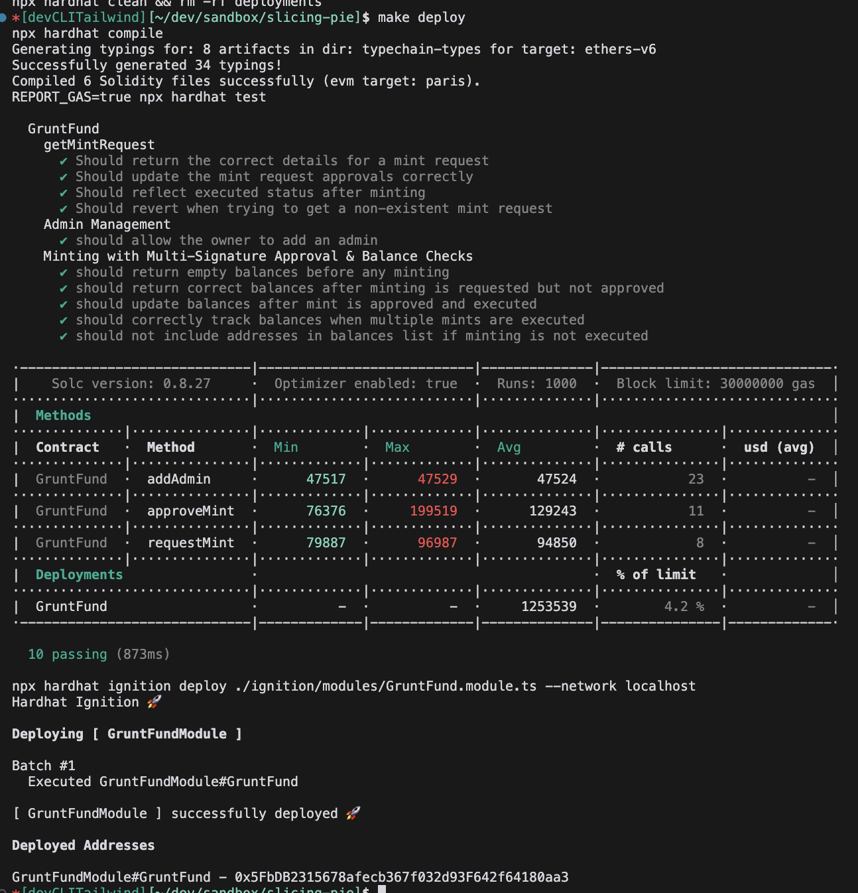

# Slicing Pie Grunt Fund

This project creates a grunt fund (see [slicingpie.com](https://slicingpie.com/)) for managing a start-up's dynamic equity.

That is, it tracks grunts' contribution into a start-up in order to ensure a fair equity split for founders.
(where a 'grunt' is anybody who's contributing to a project)

# The Contract
[The smart-contract](./contracts/GruntFund.sol) is an ERC20 smart contract written in solidity.

It's nearly the most basic Grunt Fund you can create - simply allocating (minting) pie for each Grunt account.

We've just expanded on that to add an approval step, so admins can approve those allocations.

# Roadmap

TODO:
 * deploy the contract via Makefile ✅ 
 * cli:
   * 1. Add transfer, forceTransfer, removeMinter, and isAllowedMinter to the CLi
   * 2. Create a Kind CLI w/ getAllFunds and mint functions
 * dapp: 🦕 
   * 1. Set the contract address if there isn't already one in local storage ✅ 
   * 2. Allocate pie to a grunt ✅ 
   *   2.1 keep a name/address mapping in local storage <- MVP, just have a text-area with <name>:<address> mappings ✅ 
   * 3. list allocations and show the pie / listed allocations
   * 4. list all contract events

# Command-line User Interface

You can interact with the contract using a command-line interface:

```sh
make cli
```

However, to interact with your Metamask account in this way requires access to your SEED_PHRASE in your environment.

A perhaps better way is to just use a web client and integrate in the browser

# Building / Deploying

The contract is deployed locally using [Ignition](https://hardhat.org/ignition/docs/guides/deploy) as triggered by `make deploy` (which also runs the tests):


